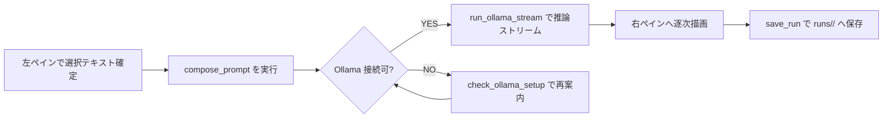

# Blueprint

## 1. Problem Statement

ローカルでプロンプトを育てる開発者・クリエイターが、選択テキストから安全にレシピ合成し Ollama 推論とログ保存まで一気通貫で完結できるようにする。

## 2. Scope

- In:
  - `src/`（Tauri Rust コマンド、React/TypeScript UI）
  - `tests/`（Rust ユニット/セキュリティ、Vitest UI テスト）
  - `data/`, `project/`, `runs/`（レシピ・ワークスペース・実行ログのサンドボックス）
  - `Day8/workflow-cookbook/`（本ワークフロー資料）
- Out:
  - `node_modules/`, `dist/`, `target/`（ビルド生成物）
  - `icons/`, `public/`（アセット置き場）
  - `docs/birdseye/` 自動生成物（参照のみ・ここでは更新対象外）

## 3. Constraints / Assumptions

- Rust（Tauri）と TypeScript（React）が同一リポジトリで連携し、双方のビルド/テストが常に成功すること。
- Ollama は `http://localhost:11434` で稼働しており、モデルは事前に pull 済みであること。
- `PROMPTFORGE_DATA_DIR` によりサンドボックスを切り替える場合も、`data/` 配下を越えたファイルアクセスは禁止。
- 既存 CLI (`npm run dev` 等)・API 互換を壊さず、保存ログ構造（`runs/<ts>/`）は後方互換を維持する。
- 変更は 100 行/2 ファイル以内で行い、設計資料の更新はこの Blueprint を基点にタスクを分岐する。

## 4. I/O Contract

- Input:
  - `compose_prompt(recipe_path, inline_params)`：YAML レシピと `user_input` を含む JSON パラメータ（例: `{"user_input":"選択文"}`）。
  - `run_ollama_stream(model, system_text, user_text)`：`compose_prompt` で得た最終プロンプトと利用モデル名。
  - `save_run(payload)`：`final_prompt`, `response`, `sha256`, `model` を含む JSON。
- Output:
  - `compose_prompt` → `{ final_prompt: string, sha256: string, model: string }`。
  - `run_ollama_stream` → `window.emit("ollama:chunk"|"ollama:end"|"ollama:error")` でストリーミング通知。
  - `save_run` → `runs/<timestamp>/` に `prompt.txt`, `response.txt`, `meta.json` を保存。

## 5. Minimal Flow

## 6. Interfaces

- CLI / Commands:
  - `npm run dev`（Vite 開発サーバー）
  - `npm run tauri:dev`（デスクトップアプリ開発起動）
  - `npm run test`, `npm run test:node`（Vitest JSDOM / Node 実行）
  - `npm run lint`（ESLint TypeScript 対象）
  - `cargo test`（Rust コマンド群とサンドボックス検証）
- Key Files / Paths:
  - `src/main.rs`（Tauri コマンド定義、Ollama 連携）
  - `src/App.tsx`, `src/useOllamaStream.ts`（UI ロジックとストリーム購読）
  - `data/recipes/*.yaml`, `data/fragments/*.yaml`（プロンプトレシピ）
  - `runs/<timestamp>/`（実行ログ: `prompt.txt`, `response.txt`, `meta.json`）

---

## Incident References

- 運用中の実例: [`docs/IN-20250215-001.md`](../../docs/IN-20250215-001.md)
- 想定シナリオ: [`docs/IN-20250310-001.md`](../../docs/IN-20250310-001.md)
- テンプレート: [`docs/INCIDENT_TEMPLATE.md`](../../docs/INCIDENT_TEMPLATE.md)
