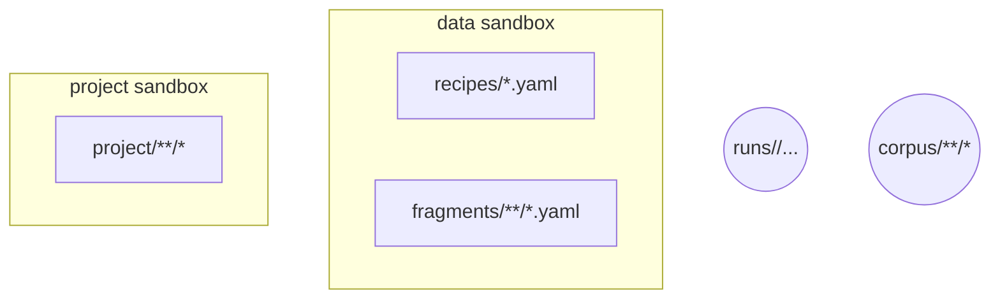
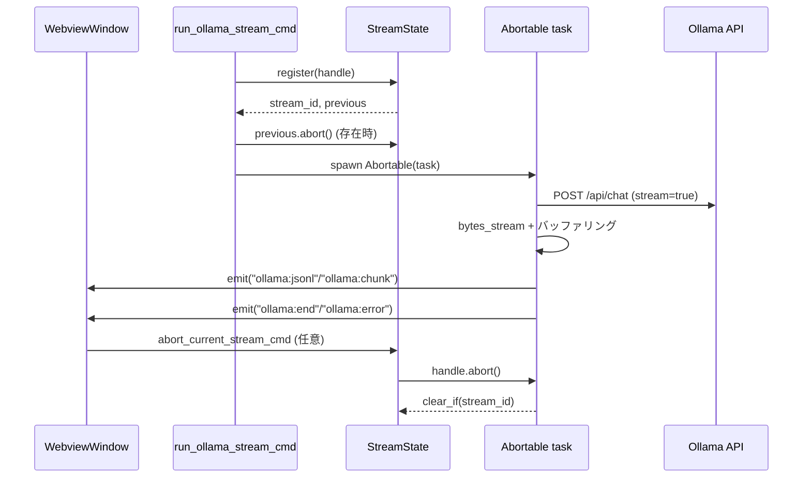

# PromptForge Rust/Tauri アーキテクチャ概要

## クレート内モジュール構成とコマンド連携
```mermaid
flowchart LR
    subgraph promptforge crate
        direction TB
        compose[compose_prompt]
        txt[txt_excerpt]
        setup[setup_check]
        stream[run_ollama_stream_impl]
        abort[abort_current_stream]
    end
    tauri[tauri::command 群 (src/main.rs)]
    compose -->|ComposeResult| tauri
    txt -->|TxtExcerpt| tauri
    setup -->|SetupCheckOutcome| tauri
    stream -->|イベント emit| tauri
    abort -->|AbortHandle 破棄| tauri
    tauri -->|generate_handler!| app[Tauri Builder]
```

- `src/lib.rs` のルートモジュールが `compose_prompt`・`run_ollama_chat`・`run_ollama_stream_impl` など主要機能を公開し、`mod` 宣言で `ollama_stream` / `setup_check` / `txt_excerpt` を内包する。【F:src/lib.rs†L1-L219】
- `src/main.rs` の `commands` モジュールで Tauri コマンドとして公開し、`tauri::generate_handler!` で GUI 側にバインドする。GUI からの呼び出しはすべてこの図の経路を辿る。【F:src/main.rs†L1-L86】【F:src/main.rs†L88-L129】
- ストリーム専用状態 (`StreamState`) は `ollama_stream.rs` で定義され、`run_ollama_stream_impl` が JSONL を解析・イベント発火し、同じ状態を `abort_current_stream` が再利用する。【F:src/ollama_stream.rs†L1-L74】【F:src/lib.rs†L220-L399】

## ストレージ境界と設計原則


- `data/`：レシピとフラグメントをホスト。`compose_prompt` 実行時は `PROMPTFORGE_DATA_DIR` を基準に `ensure_under` でディレクトリトラバーサルを防ぎ、SHA256 を算出した最終プロンプトを返す。【F:src/lib.rs†L101-L219】【F:src/lib.rs†L400-L467】
- `project/`：プロジェクト編集対象。`list_project_files`／`read_project_file`／`write_project_file` が許可拡張子チェックと `ensure_under` により境界を維持する。【F:src/lib.rs†L528-L615】
- `runs/`：`save_run` が各実行結果（レシピパス・最終プロンプト・レスポンス JSONL）をタイムスタンプ付きで保存し、リプレイ可能なログを形成する。【F:src/lib.rs†L406-L432】
- `corpus/`：`load_txt_excerpt` が部分読み込みを行い、サイズ上限やハッシュを付与した要約を返す。ここでも `ensure_under` を用いてサンドボックス化する。【F:src/txt_excerpt.rs†L1-L89】

再実装時に守るべき原則：

1. **固定サンドボックス** — ディレクトリ越境は必ず `ensure_under` 相当の検証で拒否し、未存在経路に対しても親ディレクトリを遡って判定する（`lib.rs` の実装に準拠）。
2. **監査可能なログ** — 実行結果は `runs/<timestamp>/` に整形保存し、JSONL 全体を保全する。部分ログ保存・削除は認めない。
3. **拡張子ホワイトリスト** — `project/` 配下は `assert_allowed_project_ext` と同等のチェックで書込可否を制御し、任意バイナリの流入を防ぐ。【F:src/lib.rs†L528-L615】
4. **ハッシュ付き抜粋** — `corpus/` へのアクセスは常に SHA256 とトランケーション情報を付帯し、差分検証を可能にする。【F:src/txt_excerpt.rs†L9-L79】

## Ollama 通信と Abort 制御


- `run_ollama_stream_cmd` が `StreamState::register` で `AbortHandle` を記録し、既存ハンドルは強制中断する。`Abortable` タスクは完了時・中断時に `clear_if` で状態をクリアする。【F:src/lib.rs†L220-L399】【F:src/ollama_stream.rs†L8-L44】
- ストリーム処理は JSONL 行ごとに `parse_ollama_jsonl_line` → `emit_events_for_line` を通じて UI へイベント通知し、`done` または `error` が出た時点で `ollama:end`／`ollama:error` を送出する。【F:src/lib.rs†L256-L360】【F:src/ollama_stream.rs†L46-L86】
- 中断要求は `abort_current_stream_cmd` 経由で `StreamState::take` → `AbortHandle::abort` を呼び出す設計。完了後もステートを空に戻し、次リクエストに備える。【F:src/lib.rs†L400-L408】【F:src/ollama_stream.rs†L18-L41】

例外・エラー処理ポリシー：

- **ネットワーク失敗** — `reqwest::Client::send` や `bytes_stream` 取得が失敗した場合は `String` 化したエラーで UI イベント `ollama:error` として通知し、状態をクリアする。【F:src/lib.rs†L292-L331】
- **JSONL パース失敗** — `parse_ollama_jsonl_line` が `Err` を返した場合は即座にタスクを終了させ、同様に `ollama:error` を発火してストリームを停止する。【F:src/lib.rs†L307-L328】
- **外部 Abort** — `AbortHandle` による中断では `Abortable::await` が `Err` を返すため、`clear_if` で最新ストリームのみをクリアしてリークを防ぐ。【F:src/lib.rs†L360-L399】【F:src/ollama_stream.rs†L18-L41】

以上により、Ollama への非同期ストリームは常に単一のアクティブタスクを維持しつつ、UI への逐次イベント通知と明示的な中断を両立する。
