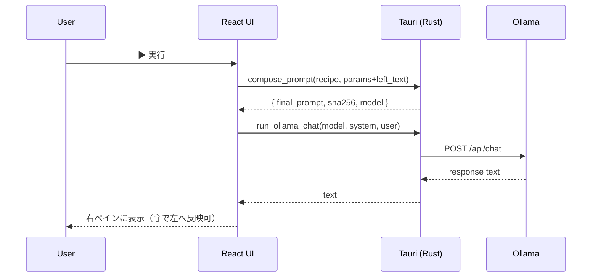
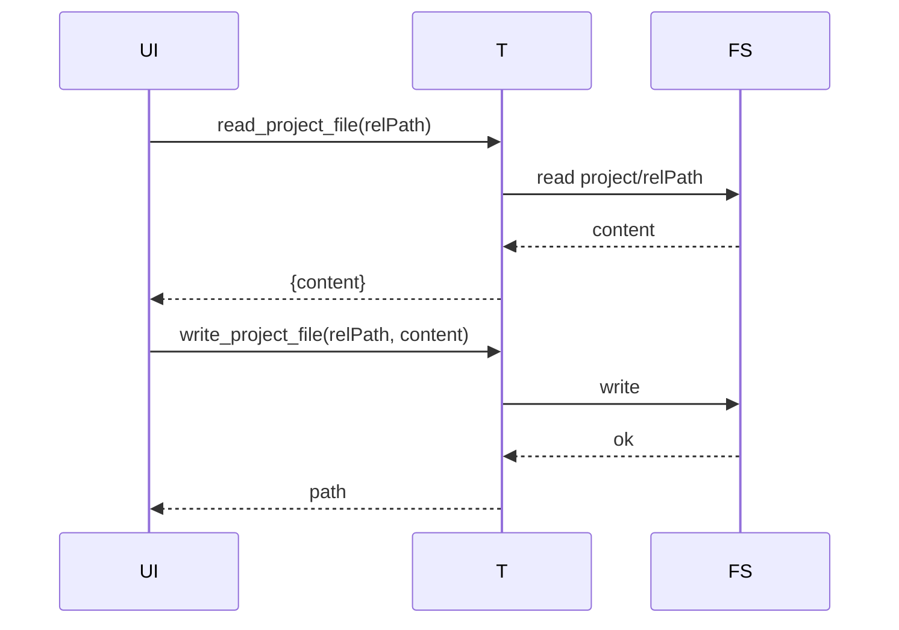
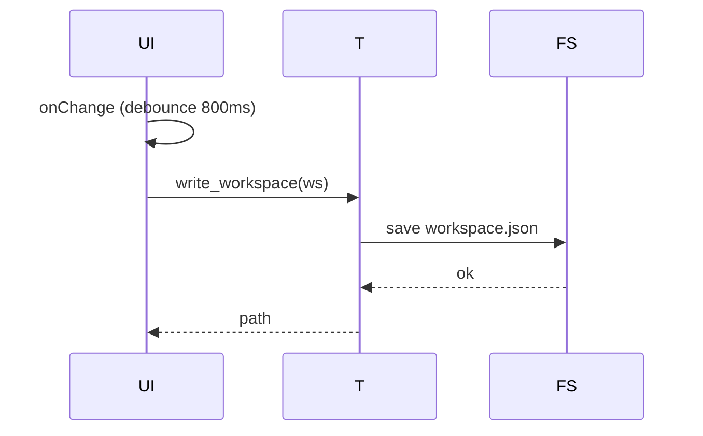

# PromptForge アーキテクチャ設計（v0.3 / MVP）

**日付**: 2025-10-18（Asia/Tokyo）  
**対象**: Windows（将来 macOS / Linux 拡張前提）  
**スタック**: Rust（Tauri v1） + TypeScript（React + Vite） + Ollama（localhost:11434）

---

## 1. 目的

- MVPの**構成要素・データフロー・境界**を確定し、拡張（ストリーミング、タブ永続化、差分適用、Monaco）の受け皿を示す。

## 2. 全体構成図

```mermaid
flowchart LR
  subgraph Frontend [Frontend: React (Vite)]
    UI[App / Editors / Toolbars]
  end

  subgraph Bridge [Bridge: Tauri (Rust)]
    CMD1[compose_prompt]
    CMD2[run_ollama_chat]
    CMD3[save_run]
    CMD4[list/read/write_project_file]
    CMD5[read/write_workspace]
  end

  subgraph Backend [Local Resources]
    FS[(Local FS)]
    OLLAMA[(Ollama API
http://localhost:11434)]
  end

  UI -- invoke --> Bridge
  CMD1 --> FS
  CMD3 --> FS
  CMD4 --> FS
  CMD5 --> FS
  CMD2 --> OLLAMA
  FS --- D1[(prompts/)]
  FS --- D2[(corpus/)]
  FS --- D3[(project/)]
  FS --- D4[(runs/<ts>/)]
  FS --- D5[(AppData/workspace.json)]
```

## 3. コンポーネント

### 3.1 Frontend（React）

- **Editors**: 左右`textarea`（将来Monacoへ差し替え可能）
- **Toolbars**: Recipe/Model/Params、▶実行、⇧反映、コピー/保存、
  ファイルバー
- **Workspace Service**: 800msデバウンスで`write_workspace`、起動時に
  `read_workspace`
- **Ollama Client**: `run_ollama_chat`を呼び出し、右ペイン更新
- **Hotkeys**: `Ctrl/Cmd+Enter`・`Ctrl/Cmd+S`・`Ctrl/Cmd+C`
- **Error UI**: アラート/トースト（将来）

### 3.2 Bridge（Tauri/Rust）

- **compose_prompt**: レシピ + フラグメント連結、`{{key}}`埋め込み、
  `USER_INPUT`追加、SHA-256算出
- **run_ollama_chat**: `POST /api/chat`（`stream=false`。将来
  `stream=true` 対応）
- **save_run**: `runs/<ts>/` に3ファイル保存
- **project I/O**: `list_project_files` / `read_project_file` /
  `write_project_file`（サンドボックス）
- **workspace**: `app_data_dir()/workspace.json` 読み書き
  （フォールバックはカレント）

### 3.3 Backend（Local）

- **ディレクトリ**
  - `prompts/`：任意のプロンプト（System含む）
  - `corpus/`：TXT（抜粋+SHAの簡易RAG）
  - `project/`：`.py/.txt/.md/.json` 編集対象
  - `runs/<ts>/`：実行アーティファクト
  - `AppData/workspace.json`：ワークスペース永続化

## 4. データ設計

### 4.1 Workspace v1

```json
{
  "version": 1,
  "left_text": "string",
  "right_text": "string",
  "recipe_path": "string",
  "model": "string",
  "params": {
    "key": "any"
  },
  "project_path": "string?",
  "updated_at": "ISO8601"
}
```

- **整合性**: 読み込み時、欠損キーはUI既定値で補完。

### 4.2 レシピ / フラグメント（YAML）

- **recipe**: `profile`, `fragments[]`, `params`  
- **fragment**: `id`, `kind`, `merge_strategy`, `content`, `trust`（任意）

### 4.3 実行ログ（runs）

- `recipe.path.txt`, `prompt.final.txt`, `response.raw.jsonl`

## 5. シーケンス図

### 5.1 実行フロー



### 5.2 プロジェクトファイル I/O



### 5.3 Workspace 自動保存



## 6. セキュリティ設計

- **サンドボックス**: `canonicalize` + `starts_with` による `ensure_under(base, target)`  
- **拡張子ホワイトリスト**: `.py/.txt/.md/.json`（MVP）  
- **HTTPスコープ**: `http://localhost:11434/*` のみ（Tauri allowlist）  
- **シンボリックリンク**: 連鎖によりsandbox外へ出ないことを `canonicalize` で保証  
- **サイズ上限**: TXT抜粋 `max_bytes`（既定 40,000）を超える場合はトランケート  
- **注入対策**: フラグメントに**injection guard**を含める（System優先）

## 7. エラーハンドリング

- **Ollama未起動**: `"ollama unreachable"` を返却、UIで起動案内  
- **パス外**: `"path out of sandbox"`  
- **UTF-8以外**: `"invalid UTF-8"`（将来: 自動再エンコード提案）  
- **I/O失敗**: OSエラー文字列を付与して返却  
- **タイムアウト**: 将来`reqwest`にtimeout設定（UIへ再試行ボタン表示）

## 8. パフォーマンス設計

- フロントは**Vite + React**、不要時はモジュール遅延読み込み（将来Monaco）  
- Autosaveは800msデバウンスで書き込み頻度を抑制  
- 大きいTXTは抜粋でLLMに渡すトークン量を制御

## 9. 拡張設計（青写真）

### 9.1 ストリーミング

- `run_ollama_chat(stream=true)` + **EventChannel**（Tauri `emit`）  
- UIは **逐次追記**と**中断ボタン**（AbortController相当）

### 9.2 タブUI永続化

- `Workspace v2`：

```json
{
  "version": 2,
  "tabs": [
    {
      "id": "ulid",
      "name": "Sora整形",
      "color": "#22c55e",
      "left": "...",
      "right": "...",
      "recipe": "...",
      "model": "...",
      "params": {}
    }
  ],
  "activeTabId": "ulid",
  "updated_at": "ISO8601"
}
```

- 起動時にv1→v2マイグレーション

### 9.3 差分適用（Unified Diff）

- 右ペインに**diff**を出させ、Rustで**安全適用**  
- 失敗ハンクはスキップ→UIに一覧提示  
- 事前プレビュー（差分ビュー）を追加

### 9.4 Monaco Editor（遅延ロード）

- ルーティングやコード分割で**バンドル肥大化**を抑制  
- Python/JSON/MDの基本機能＋検索/置換/折りたたみ

## 10. テスト戦略

- **Rustユニット**：`compose_prompt` / `ensure_under` / `workspace IO`  
- **スナップショット**：合成プロンプト（レシピ変更検知）  
- **結合**：Ollama疎通（モック可能に）  
- **手動E2E**：受け入れ基準を手順化（仕様書のQAチェックリスト準拠）

---

以上
